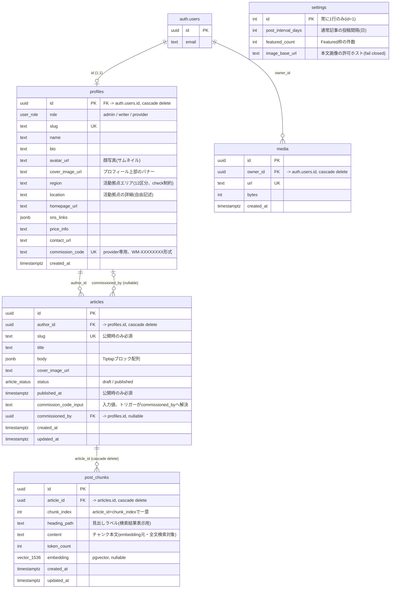

# データベース構造

Wild Media の Postgres スキーマ(`public`)の ER 図。信頼境界・RLS の詳細は [ARCHITECTURE.md](../ARCHITECTURE.md) を参照。マイグレーションの実体は `supabase/migrations/`。

## テーブルごとの補足

| テーブル | アクセス範囲 | 備考 |
|---|---|---|
| `profiles` | RLS: 本人 or admin | `role`(admin/writer/provider)。`commission_code` はprovider専用、`set_commission_code` トリガーが自動採番 |
| `articles` | RLS: 著者 or admin | `body` は Tiptap ブロックJSON(`jsonb`)。公開条件・投稿間隔・画像/埋め込みルールはすべて DB トリガーで強制(`enforce_publish_rules`・`enforce_body_image_rules`・`enforce_body_embed_rules` など) |
| `settings` | RLS: authenticated 全員read、admin write | シングルトン(`id=1`固定)。`image_base_url` は空文字が既定(fail closed) |
| `media` | RLS: 所有者 or admin | R2にアップロード済み画像のURL記録のみ。記事から参照中の画像は削除不可(`block_media_in_use`) |
| `post_chunks` | RLS: ポリシーなし(service role専用) | ハイブリッド検索用。`embedding`(pgvector, 1536次元)+ `content`(pgroonga全文検索対象)。anon/authenticatedからは直接アクセス不可、`chunk-article`/`search-articles` Edge Function経由のみ |

## 主なDB関数(トリガー・RPC)

| 関数 | 種別 | 役割 |
|---|---|---|
| `is_admin()` | トリガー内で使用 | 呼び出しユーザーがadmin roleかを判定 |
| `set_commission_code()` | トリガー | provider の `commission_code` を自動採番 |
| `validate_commission_code(code)` | RPC | 依頼者コードの実在チェック(完全一致のみ応答、列挙攻撃防止) |
| `resolve_commission_code()` | トリガー | 記事保存時、`commission_code_input` から `commissioned_by` を解決 |
| `enforce_publish_rules()` | トリガー | 公開条件(投稿間隔・本文必須など)を強制 |
| `enforce_body_image_rules()` | トリガー | 本文中の画像枚数・ホスト許可を強制 |
| `enforce_body_embed_rules()` | トリガー | 本文中の埋め込み(YouTube/Vimeo/X)ホスト許可を強制 |
| `block_media_in_use()` | トリガー | 記事から参照中の `media` 行の削除を禁止 |
| `search_articles_hybrid(query_embedding, query_text, match_count)` | RPC(service role専用) | pgvector類似検索 + pgroonga全文検索をRRFでマージし、`articles.status='published'` をDB層で強制した上で上位記事を返す |
