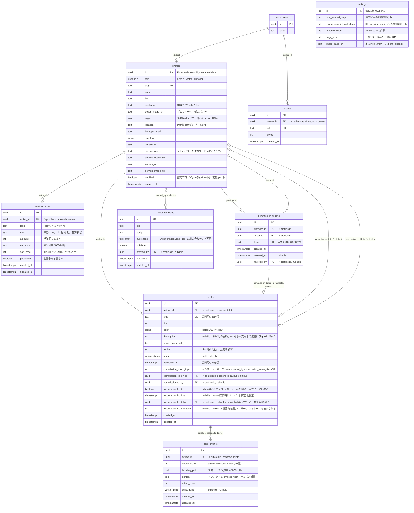

# データベース構造

Wild Media の Postgres スキーマ(`public`)の ER 図。信頼境界・RLS の詳細は [ARCHITECTURE.md](../ARCHITECTURE.md) を参照。マイグレーションの実体は `supabase/migrations/`。

## テーブルごとの補足

| テーブル | アクセス範囲 | 備考 |
|---|---|---|
| `profiles` | RLS: 本人 or admin(select/update)。writer は全認証ユーザーに公開(select、依頼先選択用) | `role`(admin/writer/provider)。`certified` は admin のみ変更可(トリガー) |
| `articles` | RLS: select/update/delete は著者 or admin。insert は著者(=自分)かつ writer roleのみ(admin・providerは記事を作成できない) | `body` は Tiptap ブロックJSON(`jsonb`)。公開条件・投稿間隔・画像/埋め込みルールはすべて DB トリガーで強制(`enforce_publish_rules`・`enforce_body_image_rules`・`enforce_body_embed_rules` など)。`moderation_hold` はadmin専用の審査ホールドで、`status`とは独立に公開サイト・検索での可視性を上書きする(`protect_moderation_hold_columns`) |
| `settings` | RLS: authenticated 全員read、admin write | シングルトン(`id=1`固定)。`image_base_url` は空文字が既定(fail closed) |
| `pricing_items` | RLS: writer 本人 or admin(select/insert/update/delete)。CMS内で他人の料金は見えない | ライターの公開プロフィール(`/writers/[slug]`)に載せる料金プラン。`published=true` の行を `sort_order` 昇順で表示。公開サイトのビルドは service role で読むので RLS はバイパスされる |
| `media` | RLS: 所有者 or admin | R2にアップロード済み画像のURL記録のみ。記事から参照中の画像は削除不可(`block_media_in_use`) |
| `announcements` | RLS: admin は全件CRUD。writer/providerはpublished=trueかつ自分のaudienceのみselect。anonはpublished=trueかつend_user向けのみselect | 公開サイトが初めてブラウザから直接(anon key + RLS)読むテーブル。他の公開データはビルド時にservice roleで読む |
| `post_chunks` | RLS: ポリシーなし(service role専用) | ハイブリッド検索用。`embedding`(pgvector, 1536次元)+ `content`(pgroonga全文検索対象)。anon/authenticatedからは直接アクセス不可、`chunk-article`/`search-articles` Edge Function経由のみ |

## 主なDB関数(トリガー・RPC)

| 関数 | 種別 | 役割 |
|---|---|---|
| `is_admin()` | トリガー内で使用 | 呼び出しユーザーがadmin roleかを判定 |
| `is_writer()` | RLSポリシー内で使用 | 呼び出しユーザーがwriter roleかを判定(`articles` insert の制限に使用) |
| `is_provider()` | RLSポリシー内で使用 | 呼び出しユーザーがprovider roleかを判定(`announcements` select の対象出し分けに使用) |
| `set_commission_token()` | トリガー | `commission_tokens` insert時、provider_idを呼び出し本人に強制し、トークンを自動採番 |
| `guard_commission_token_revoke()` | トリガー | `revoked_at` の null→非null 変更のみ許可し、使用済みトークンの取消を拒否 |
| `validate_commission_token(token, article_id)` | RPC | 依頼トークンの実在チェック(呼び出し本人宛て・未取消・未使用〈article_idは自分自身を除外〉のみ応答) |
| `resolve_commission_token()` | トリガー | 記事保存時、`commission_token_input` から `commissioned_by`/`commission_token_id` を解決 |
| `enforce_publish_rules()` | トリガー | 公開条件(投稿間隔・本文必須など)を強制 |
| `enforce_body_image_rules()` | トリガー | 本文中の画像枚数・ホスト許可を強制 |
| `enforce_body_embed_rules()` | トリガー | 本文中の埋め込み(YouTube/Vimeo/X)ホスト許可を強制 |
| `block_media_in_use()` | トリガー | 記事から参照中の `media` 行の削除を禁止 |
| `protect_moderation_hold_columns()` | トリガー | `moderation_hold`/`_at`/`_by` の変更をadminのみに制限し、変更時に `_at`/`_by` をサーバー側で自動設定・自動クリアする |
| `search_articles_hybrid(query_embedding, query_text, match_count, max_distance)` | RPC(service role専用) | pgvector類似検索 + pgroonga全文検索をRRFでマージし、`articles.status='published' and not moderation_hold` をDB層で強制した上で上位記事を返す。ベクトル側は cosine distance が `max_distance`(既定0.5)以下のチャンクのみ候補にして、無関係な記事が kNN の下位に紛れ込まないようにする |
